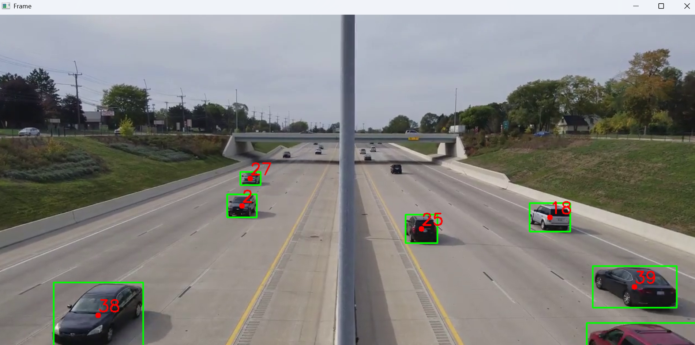

# 🚀 Smart Object Detection & Tracking System using YOLOv4 and OpenCV

A real-time AI-powered Object Detection and Tracking System built with **YOLOv4**, **OpenCV**, and a custom **Centroid Tracking Algorithm**.  
The system detects multiple objects in video streams and assigns a unique tracking ID to each detected object in real time.

---

# 📌 Project Overview

This project combines **Deep Learning** and **Computer Vision** techniques to perform:

- Real-time object detection
- Multi-object tracking
- Unique object ID assignment
- Bounding box visualization
- Video frame processing

The system uses the **YOLOv4** deep learning model trained on the **COCO dataset** for object detection and a lightweight centroid-based tracking algorithm for tracking detected objects across frames.

---

# 🧠 Technologies Used

- Python
- OpenCV
- YOLOv4
- NumPy
- Deep Learning
- Computer Vision

---

# 📂 Project Structure

```bash
AI-Tracking-System/
│
├── assets/
│   ├── detect1.png
│   └── detect2.png
│
├── dnn_model/
│   ├── yolov4.weights
│   ├── yolov4.cfg
│   └── classes.txt
│
├── object_detection.py
├── tracking.py
├── requirements.txt
└── README.md
```

---

# ⚡ Features

- 🎯 Real-time object detection
- 🆔 Unique ID assignment for each object
- 📦 Multi-object tracking
- 🎥 Video file processing support
- ⚡ Lightweight CPU execution
- 🧠 Deep learning-based detection using YOLOv4
- 📍 Bounding box and centroid visualization
- 🔄 Continuous object movement tracking

---

# 🔍 System Workflow

## 1️⃣ Object Detection

The YOLOv4 model detects objects in every frame of the input video.

### Detection Output Includes:
- Object class name
- Confidence score
- Bounding box coordinates

---

## 2️⃣ Centroid Extraction

Detected object bounding boxes are converted into centroid points.

Example:

```python
center_x = int((x + x + w) / 2)
center_y = int((y + y + h) / 2)
```

---

## 3️⃣ Object Tracking

The tracking algorithm:
- Calculates centroid distances
- Matches objects frame-by-frame
- Assigns persistent unique IDs
- Removes lost objects automatically

---

# 📸 Project Output

## 🧠 Object Detection Output

<p align="center">
  
</p>

---

## 📦 Object Tracking Output

<p align="center">
  
</p>

---

# ⚙️ Installation Guide

## 1️⃣ Clone the Repository

```bash
git clone https://github.com/hamzamehmoodkhan1245/AI-Tracking-System.git
cd AI-Tracking-System
```

---

## 2️⃣ Install Required Dependencies

```bash
pip install -r requirements.txt
```

---

# 📥 Download YOLOv4 Model Files

You must download the pretrained YOLOv4 model files and place them inside the `dnn_model/` folder.

---

## Required Files

| File Name | Description |
|---|---|
| `yolov4.weights` | Pretrained YOLOv4 weights |
| `yolov4.cfg` | YOLOv4 configuration file |
| `classes.txt` | COCO dataset class labels |

---

## Final Folder Setup

```bash
dnn_model/
├── yolov4.weights
├── yolov4.cfg
└── classes.txt
```

---

# ▶️ Run the Project

```bash
python object_detection.py
```

---

# 📊 Detection Capabilities

The YOLOv4 model can detect multiple object categories including:

- Person
- Car
- Bus
- Truck
- Bicycle
- Motorcycle
- Dog
- Cat
- Chair
- Bottle
- And many more...

---

# 🧠 Tracking Algorithm Details

This project uses a custom centroid-based tracking system.

## Tracking Process:
1. Detect objects
2. Compute centroids
3. Measure centroid distance
4. Match closest objects
5. Maintain unique IDs

---

# 💡 Advantages of the Project

- Fast and lightweight
- Works on CPU
- Real-time processing
- Easy to understand architecture
- Modular project structure
- Beginner-friendly AI project
- Scalable for future upgrades

---

# 🚀 Future Improvements

- 🌐 Real-time webcam integration
- 📊 Detection analytics dashboard
- 📝 Export logs to CSV/Excel
- 🔐 Authentication system
- ☁ Cloud deployment
- 📱 Mobile application support
- 🧠 AI-based behavior analysis
- 🌍 Web application using Flask/Django/React

---

# 📋 Requirements

Example `requirements.txt`:

```txt
opencv-python
numpy
```

---

# 👨‍💻 Author

## Hamza Haroon

- 📧 Email: hamzamehmoodkhan1245@gmail.com
- 🔗 GitHub: https://github.com/hamzamehmoodkhan1245

---

# ⭐ Support the Project

If you found this project helpful:

- ⭐ Star the repository
- 🍴 Fork the project
- 🧠 Contribute improvements
- 🚀 Share with others

---

# 📜 License

This project is developed for educational and learning purposes.

---
